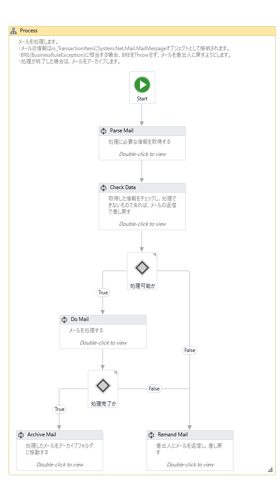

# ReFramework Template Mail Transaction

IMAPメールをトランザクションとして処理するUiPath Reframeworkテンプレート

## 内容

届いたメールを自動処理するロボットを作成するためのテンプレートです。

* メールはIMAPで取得し、SMTPで送信するものとします。
* 処理内容はメール本文、添付ファイルから取得するものとします。
* 処理に成功した場合は、メールを処理済フォルダに移動し、BREに相当するエラーの場合は、差出人にメールの返信で差し戻します。

## 設定

Data¥Condig.xlsxで以下の設定ができます。

Settingタブ

| Name                     | Default                    | Description                                                                                  |
|:-------------------------|:---------------------------|:---------------------------------------------------------------------------------------------|
| logF_BusinessProcessName	| Framework Mail Template | ワークフローの名称（ログに出力されます）|
| IMAP_Server | -   | IMAP サーバー名 |
| IMAP_Port | -   | IMAP ポート番号 |
| IMAP_Credential | - | IMAP ログインクレデンシャル名（Orchestrator Credential名またはWindows資格情報名 |
| IMAP_Top | 30 | 取得するメッセージの数 |
| Mail_Folder | Inbox | メッセージの取得元のメールフォルダー |
| Mail_Subject_Filter | * | 対象メッセージを選択するための件名のパターン（正規表現） |
| Mail_Archive_Folder | Archive | 処理済メッセージを移動するメールフォルダー |
| Mail_Remand_Mail_Template | .\Data\ReamdMailTemplate.txt | 差し戻しメールの本文テンプレート |

Constantsタブ

| Name           | Default | Description  |
|:---------------|:--------|:-------------|
| MaxRetryNumber | 3       | リトライ回数 |

1. テンプレート一式をダウンロードします。

2. project.jsonの"name","description"を修正します。

3. Data¥Config.xslxにIMAPの情報、メールの情報を設定します。

4. Process.xamlを実装します。

  * メールの情報はin_TransactionItemにSystem.Net.Mail.MailMessageオブジェクトとして格納されます。
  * Parse Mailの実装
  メールの内容から処理に必要なデータ（メール本文、添付ファイルなど）を取得します。
  * Check Dataの実装
  取得したデータをチェックします。処理が継続できない場合（Business Rule Exceptionに相当）は、BREをThrowするのではなく、SuccessをFalseに設定して、前任者に返信メール差し戻します。申し送り事項がある場合は、MailBodyに内容を記載します。
  * Do Mailの実装
  取得した情報に基づき、処理を行います。処理が失敗した場合（Business Rule Exceptionに相当）は、BREをThrowするのではなく、SuccessをFalseに設定して、前任者に返信メール差し戻します。申し送り事項がある場合は、MailBodyに内容を記載します。

    
